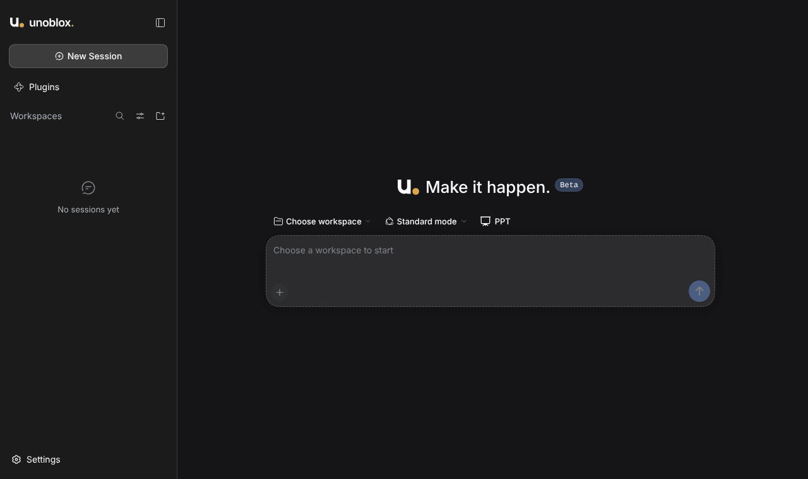

<h1 align="center">
  
  Unoblox
</h1>

<p align="center">
  <strong>Make it happen.</strong> A desktop AI agent for macOS, Windows and Linux, powered by the <a href="https://unoblox.ai">Unoblox</a> unified AI gateway.
</p>

<p align="center">
  <a href="LICENSE"></a>
  
  
  
  
</p>



Unoblox runs AI agents on your computer. In the workspace folders you choose, an agent can read and write files, run commands, search the web, and create documents, spreadsheets and slides. Risky actions ask for your approval first.

Every model call goes through the Unoblox gateway with one API key and one prepaid ₹ balance: pick **Unoblox Auto** to route each request to the best-value model, or choose a specific model per conversation from the live catalog.

> [!IMPORTANT]
> Unoblox is in **beta**. Installers are not yet signed with paid Apple or Microsoft certificates, so your computer asks you to confirm the app once on first open, and the app does not update itself yet. See [Install Unoblox Beta](docs/install.md).

## Install

| Platform | Installer |
| --- | --- |
| macOS (Apple Silicon, M1 or later) | `Unoblox-Beta-<version>-mac-arm64.dmg` |
| Windows 10/11 x64 | `Unoblox-Beta-<version>-windows-x64-setup.exe` (NSIS) |
| Linux x64 | `Unoblox-Beta-<version>-linux-amd64.deb` (Ubuntu, Debian) or `Unoblox-Beta-<version>-linux-x86_64.AppImage` |

Beta installers are built by the **Build beta installers** workflow in this repository's Actions tab. Step-by-step instructions, including the one-time first-open prompt on each system, are in [docs/install.md](docs/install.md). You need an Unoblox API key from the Unoblox developer portal; the app asks for it on first launch.

## What it does

- **Agents that act:** file edits, shell commands (with your approval policy), web search and web fetch, inside the workspaces you add with the system folder picker.
- **One gateway, many models:** Unoblox Auto or any tool-capable model from the live Unoblox catalog. The composer shows your balance and the model that served the last reply.
- **Documents:** offline DOCX, PPTX and XLSX skills with a bundled Python runtime, and a PPT mode that turns source material into editable PPTX decks from 16 templates.
- **Phone access:** continue sessions from your phone on the same Wi-Fi, or through a temporary Cloudflare Quick Tunnel (Pinggy as fallback) when you choose internet mode. The bridge listens only while you pair, while a paired phone is attached, or when **Harness › Keep Phone Connected** is on.
- **Recovery:** startup and plugin failures are detected and logged to `harness.log`, with a guided recovery screen and a non-destructive Safe Mode that blocks third-party plugins. If the normal interface cannot open, start with `--safe-mode` (macOS: `open -a "Unoblox" --args --safe-mode`).
- **Portable presets:** import and export custom agent presets as [`.dshpreset` packages](docs/preset-packages.md).

## Privacy

Unoblox collects no usage or analytics data, and talks to no server on its own except the Unoblox API (`api.unoblox.ai`). Everything else (web pages an agent fetches, plugins you install, phone tunnels) happens only when you ask for it. Details, and the tests that keep it that way, are in [docs/privacy.md](docs/privacy.md).

Your API key is stored on your machine in the Harness credential store and is sent only to `api.unoblox.ai`. Conversations, workspaces and settings stay in your user data folder.

## Security

- The agent interface is served only on a random loopback (`127.0.0.1`) port.
- The renderer has no Node.js privileges and runs with context isolation and sandboxing.
- Webviews, untrusted in-app navigation and unexpected permission requests are blocked; external links open in your browser.
- Phone access needs a short-lived pairing token; over the internet it also needs the pairing password shown on the computer.

## Development

Unoblox is built on the open-source [DeepSeek Harness](https://github.com/deepseek-ai/deepseek-harness) (`@deepseek-ai/dsh@0.2.0-rc.2`) and started from the MIT-licensed DSH Desktop. Read [AGENTS.md](AGENTS.md) first, then:

- [Development guide](docs/development.md): setup, validation, patch maintenance and target-native packaging
- [Architecture](docs/architecture.md): runtime flow, persistent data, security boundaries, recovery and mobile access
- [Installers](docs/installers.md): beta and development builds per platform
- [Unoblox provider](docs/unoblox-provider.md): how the gateway, model catalog and balance strip are wired

```bash
npm ci
npm run typecheck
npm test
npm run package:beta:linux   # or package:beta:mac:arm64 / package:beta:win on that system
```

Installers are built on the matching operating system; cross-builds are refused. Never include real API keys in issues, logs, screenshots or test data.

## License

Unoblox is open source under the [MIT License](LICENSE). DeepSeek Harness and its dependencies remain under their own licenses and trademark policies.
